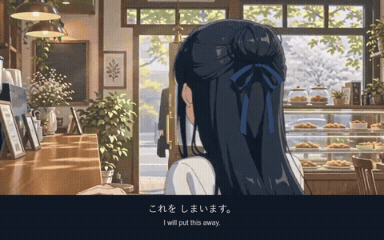
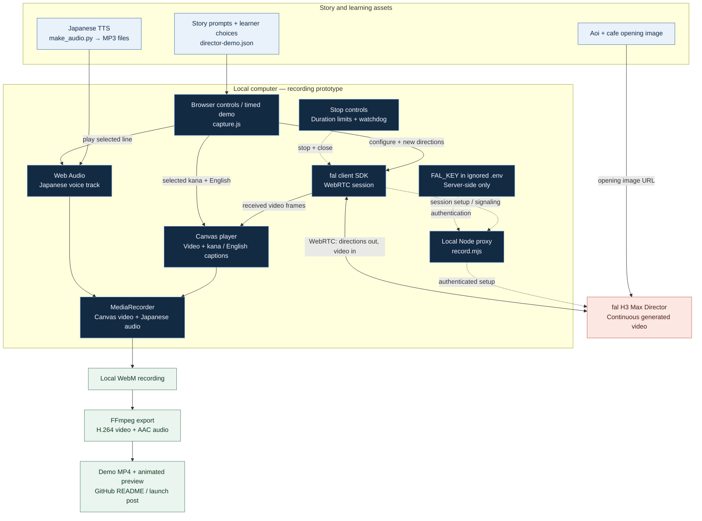

<p align="center">
  
</p>

<h1 align="center">Tomorrow, Once More</h1>
<p align="center"><strong>もういちど、あした</strong><br>Learn Japanese. Change Aoi’s tomorrow.</p>

<p align="center">
  <a href="repo_assets/clips/director-live-demo.mp4">Watch the Director demo</a> ·
  <a href="launch/fal-director/">Run the prototype</a> ·
  <a href="output/pdf/Tomorrow_Once_More_Opening_Hour.pdf">Read the screenplay</a>
</p>

Aoi wakes one year before her family’s café collapses. A familiar cup, a suspicious receipt, and one unexpected visitor become clues to a future she wants to change.

**Tomorrow, Once More** explores learning Japanese through story: Japanese speech, kana-only Japanese captions, English meanings, and choices that give each phrase a purpose.

## See the story move

<p align="center">
  <a href="repo_assets/clips/director-live-demo.mp4">
    
  </a>
</p>
<p align="center"><strong>Actual H3 Max Director footage</strong> · 52-second demo · Japanese voice + kana/English captions<br>
<a href="https://raw.githubusercontent.com/ronithrashmikara/tomorrow-once-more/main/repo_assets/clips/director-live-demo.mp4">Open / download the full demo MP4</a></p>

The recording begins with Aoi inspecting a clue and follows her putting it away. The local recorder sends story choices during the same Director session. Japanese TTS and captions are added by the application.

## Why H3 Max Director?

A learner’s choice can become a new direction while the video session continues. That makes Director useful for a drama where the viewer influences the next action.

| Part | What it does |
| --- | --- |
| **Opening image** | Establishes Aoi and the café using the project’s existing artwork. |
| **Director stream** | Generates animated footage and accepts new story directions during playback. |
| **Choice prompts** | Describe the next action: save the receipt, call Misaki, or go to the station. |
| **Learning layer** | Adds controlled Japanese speech and readable kana + English captions. |
| **Local recorder** | Captures the result and closes the session at its duration limits. |

This is a **working local prototype**. The recorded choices were triggered by a timed script; buttons are also implemented. Both directions were accepted, but the phone-call scene arrived at the stop limit and is not shown playing through in the recording. See the [measured run report](launch/fal-director/RUN_REPORT.md) for the exact results.

## How the system works

The Director prototype combines live generated video with a local learning layer. The proxy authenticates session setup; prompts and video then travel over the WebRTC connection. Japanese voice and captions are composed locally for the recording.



[Editable diagram source](repo_assets/diagrams/system-architecture.mmd)

The stop controls limit the local session; they are not a provider-enforced spending cap. Director's native audio is not mixed into this demo—the exported Japanese voice comes from the TTS files. The separate illustrated-film pipeline uses screenplay → TTS + character/scenery renderer → FFmpeg, without calling Director.

## Try the Director recorder

Requires **Node.js 22+ and Google Chrome**. Run these commands from the repository root:

```powershell
cd launch/fal-director
npm ci --legacy-peer-deps
node record.mjs
```

The default command is a **free local dry run**; it does not call fal.

For a paid recording, create a local `.env` file inside `launch/fal-director/` containing `FAL_KEY=your-key`, then run:

```powershell
node --env-file=.env record.mjs --live
```

The key stays on the local server and the file is ignored by Git. One command admits one session; rerunning it starts another paid attempt. The recorder stops at its recording, generated-duration, or watchdog limit. These are local safeguards, not a provider-enforced dollar cap.

The first run used **one paid session with no retry**. Seven reported 10-second chunks imply **about $1.40 at the launch rate**; the actual bill could not be verified with the key’s permissions. Check [fal’s current pricing](https://fal.ai/h3-max-director) before running it. Details and output locations are in the [Director guide](launch/fal-director/README.md).

## The longer learning drama

The project also contains an illustrated-film pipeline, separate from the Director experiment:

- **24-scene opening screenplay** with kana Japanese and English translation.
- **Bilingual screenplay PDF** and grammar planning materials.
- **10 character cutouts** and **5 illustrated locations**.
- Japanese TTS generation, captions, and white-background or scenic rendering.
- A finished **67-minute scenic cut**, kept locally; short excerpts are included below.


| Scene | Watch |
| --- | --- |
| Aoi wakes to the blue cup | [Opening rewind](repo_assets/clips/opening-rewind.mp4) |
| Rina arrives in a red scarf | [Red-scarf scene](repo_assets/clips/red-scarf.mp4) |
| A call from tomorrow | [Future-phone scene](repo_assets/clips/tomorrow-calls.mp4) |

The 67-minute film uses animated still artwork. The Director demo above uses generated video. The full 67-minute MP4 is excluded from Git; the Director MP4 and these short clips are committed.

## Render an illustrated scene

The current renderer targets **Windows** and uses its Yu Gothic fonts. Install Python 3.12, FFmpeg (including `ffprobe`) on PATH, and the Python dependencies:

```powershell
python -m pip install Pillow numpy edge-tts
python drama/film/tts_build.py
python drama/film/render_anim.py --scenes 1,2 --visual-mode scenic --suffix _preview
```

Use `--visual-mode white` for the study layout. The video is written to `output/`.

## Make another story

1. Copy [the story template](drama/film/story_template.json) and write bilingual scene blocks.
2. Add transparent character PNGs to `drama/film/characters/` and map speakers in the TTS and renderer scripts.
3. Add scenery to `drama/film/backgrounds/` and map scenes in [visuals.json](drama/film/visuals.json).
4. Generate speech, then render a short preview before producing the full film.

```powershell
python drama/film/tts_build.py --screenplay my_story.json --audio-dir build/my_story/audio --lines-out build/my_story/lines.json
python drama/film/render_anim.py --lines build/my_story/lines.json --audio-dir build/my_story/audio --wav-dir build/my_story/wav --visual-mode scenic --suffix _my_story
```

## Explore the repository

| Folder / file | Contents |
| --- | --- |
| [launch/fal-director](launch/fal-director/) | Working capture code, dependencies, prompts, audio, launch copy and run report |
| [drama/screenplay.json](drama/screenplay.json) | Editable bilingual screenplay |
| [drama/film](drama/film/) | TTS, illustrated renderer, character art and scenery |
| [repo_assets/clips](repo_assets/clips/) | Director demo MP4, animated preview and illustrated-film excerpts |
| [output/pdf](output/pdf/) | Downloadable learning documents |

## Next chapters

- Align captions and voice with the scene that actually reaches the player.
- Expand the short demo into richer branching conversations.
- Add authenticated access and persistent spending controls before opening paid generation to visitors.
- Review Japanese language quality and measure grammar coverage through the story.

Built by **Ronith Rashmikara**. Shared on X as the creator’s first post in September 2026.
