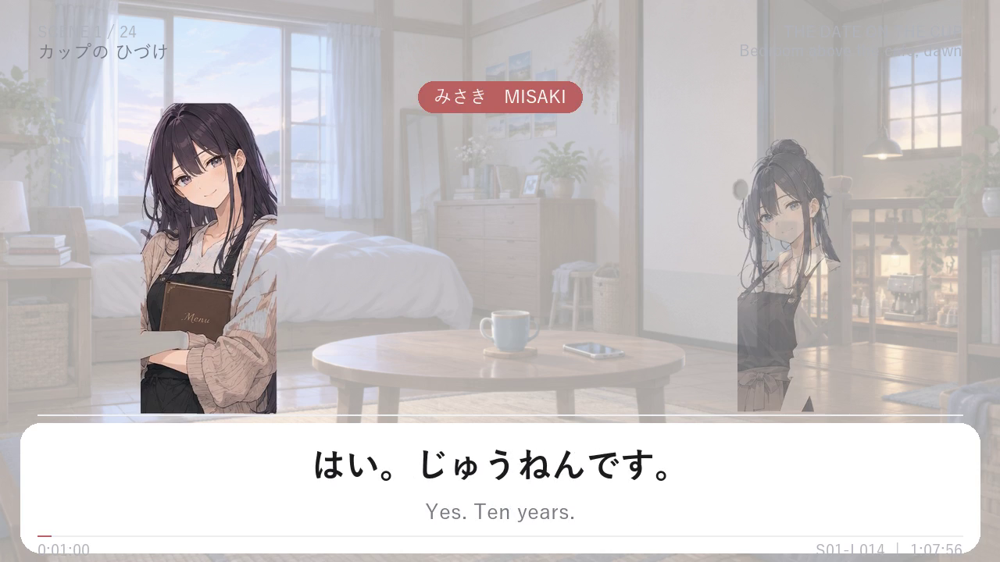

<p align="center">
  
</p>

<h1 align="center">Tomorrow, Once More</h1>

<p align="center"><i>A Japanese-learning drama about changing one ordinary day before it becomes too late.</i></p>

An illustrated Japanese-learning drama. Aoi wakes one year before her family cafe collapses and tries to change the future. The first-hour cut teaches through Japanese speech, kana/katakana captions, English meaning, and character-led scenes.



## Watch short previews

These excerpts are compact H.264 videos with Japanese audio, kana captions, English meaning, character art, and illustrated scenery.

| Moment | Preview |
| --- | --- |
| Aoi wakes to the blue cup | [Watch the opening rewind](repo_assets/clips/opening-rewind.mp4) |
| Rina arrives in the red scarf | [Watch the red-scarf scene](repo_assets/clips/red-scarf.mp4) |
| Tomorrow calls back | [Watch the future-phone scene](repo_assets/clips/tomorrow-calls.mp4) |


## What is already built

- A 24-scene opening-hour screenplay with Japanese in kana and English translation.
- Japanese neural voice audio for the scene lines.
- A finished 67-minute scenic video (`output/Tomorrow_Once_More_Animated_Scenic.mp4`, excluded from Git because it is too large for the repository).
- Ten character cutouts, including Aoi, Misaki, Haru, Rina, Ren, Yui, Sato, Nao, the clerk, and a regular customer.
- Illustrated bedroom, kitchen, cafe, station, and back-room scenery mapped across all 24 scenes.
- A white-background study mode and a scenic mode.

## Live Director launch demo

The prepared [fal H3 Max Director launch kit](launch/fal-director/) turns Aoi's first scene into a 90-second interactive stream. It includes the 16:9 Aoi/cafe opening frame, three learner choices, exact prompt messages, overlay captions, and a $3 launch budget cap.

## Add artwork

Put transparent PNG character art in `drama/film/characters/`. Use either the Japanese role name or its English role name: `あおい.png` / `aoi.png`, `みさき.png` / `misaki.png`, and so on. The current renderer already has art for Aoi, Misaki, Haru, Rina, Ren, Yui, Sato, the clerk, and the customer.

Put 16:9 scenery images in `drama/film/backgrounds/` and map scene numbers to filenames in `drama/film/visuals.json`. The renderer keeps a light white overlay and a solid caption zone so the Japanese stays readable.

## Render

Use Python 3.12 with `Pillow`, `numpy`, and FFmpeg installed. Build or refresh speech from `drama/screenplay.json`, then render the selected scenes:

```powershell
python drama/film/tts_build.py
python drama/film/render_anim.py --scenes 1,2 --visual-mode scenic --suffix _preview
```

Use `--visual-mode white` for the clean teaching layout. The rendered file is written to `output/`.

## Reuse this pipeline for another story

1. Copy `drama/film/story_template.json` and write the new bilingual screenplay. Keep Japanese in kana/katakana if that is the learning format you want.
2. Supply character cutouts and map any new speaker labels in `tts_build.py` and `render_anim.py`.
3. Add scenery assets and update `visuals.json`.
4. Run TTS, then render a short scene preview before rendering the full story.

The pipeline keeps dialogue, English gloss, Japanese audio, captions, art, and timing separate. It also accepts a different screenplay and cue-sheet path:

```powershell
python drama/film/tts_build.py --screenplay my_story.json --audio-dir build/my_story/audio --lines-out build/my_story/lines.json
python drama/film/render_anim.py --lines build/my_story/lines.json --audio-dir build/my_story/audio --wav-dir build/my_story/wav --visual-mode scenic --suffix _my_story
```
